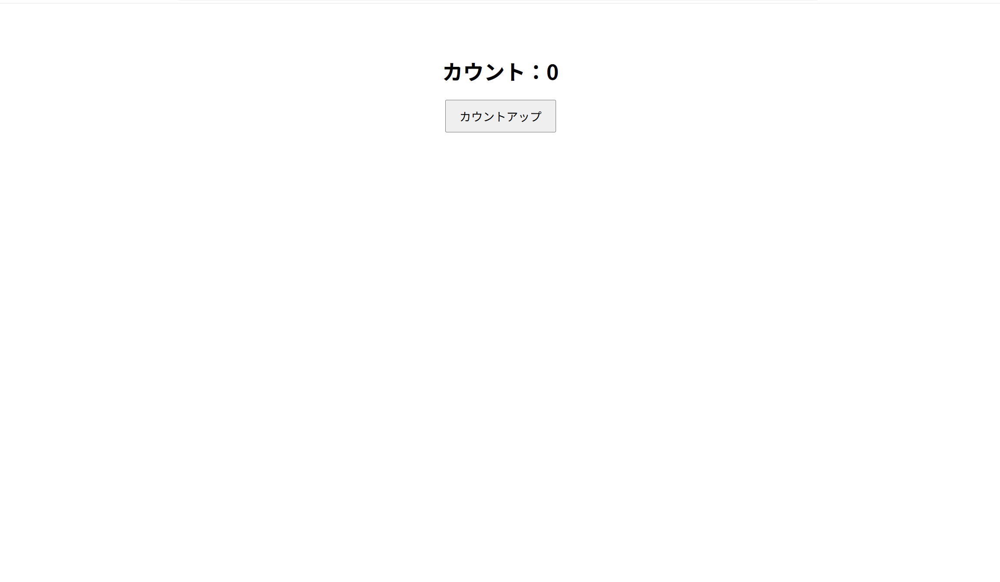
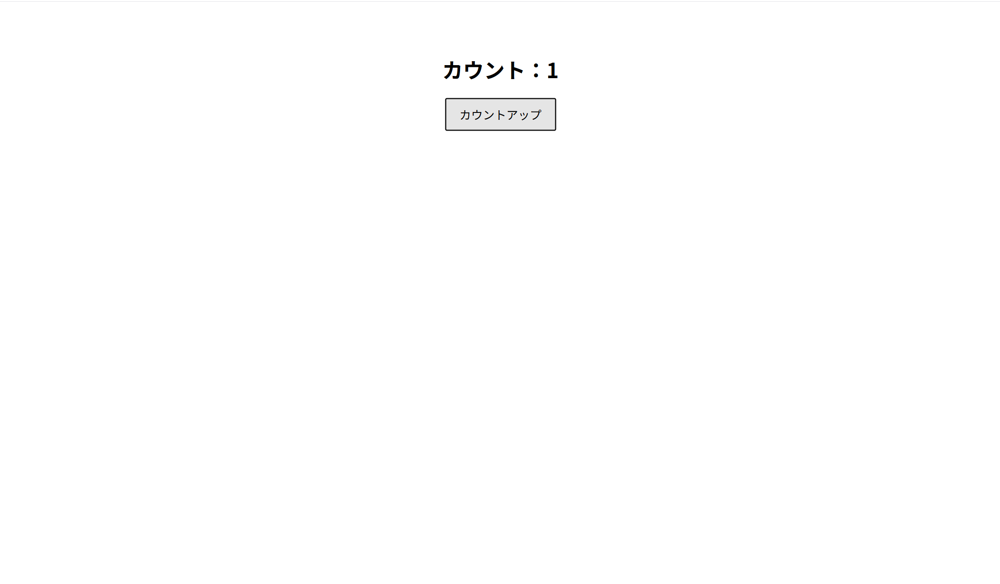

# カウントアップアプリ

#概要
このアプリは、ボタンをクリックするたびに数字が1つずつ増えていく「カウントアップアプリ」です。  
JavaScriptの基本的なDOM操作とイベント処理を学ぶために作成しました。

#使用技術
・HTML（画面構成）
・CSS（ボタンや文字のデザイン）
・JavaScript（カウントアップの処理・イベントリスナー）

#工夫した点
・HTML、CSS、JavaScriptのファイルを分けて構成し、見やすさを意識しました。
・`addEventListener`を用いて、JavaScriptとHTMLの分離を行いました。

#カウントが0の時のスクリーンショット

#カウントが1と増えた時のスクリーンショット

